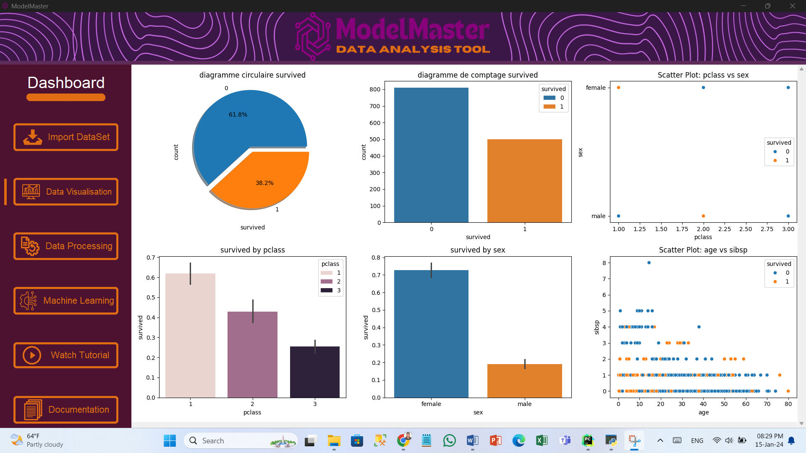
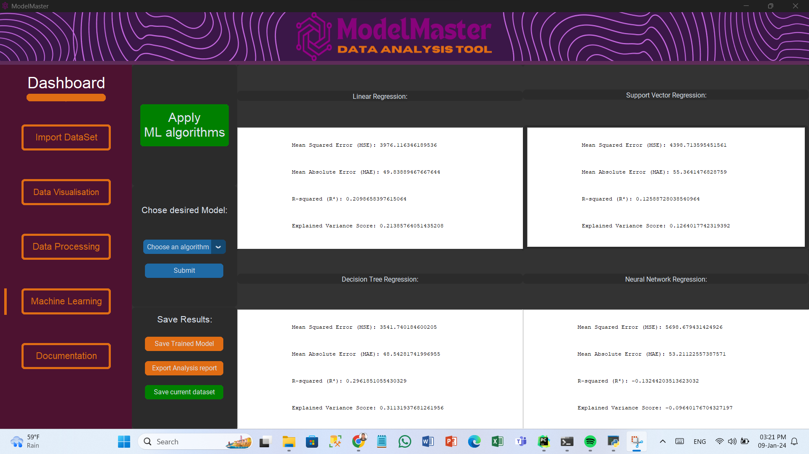
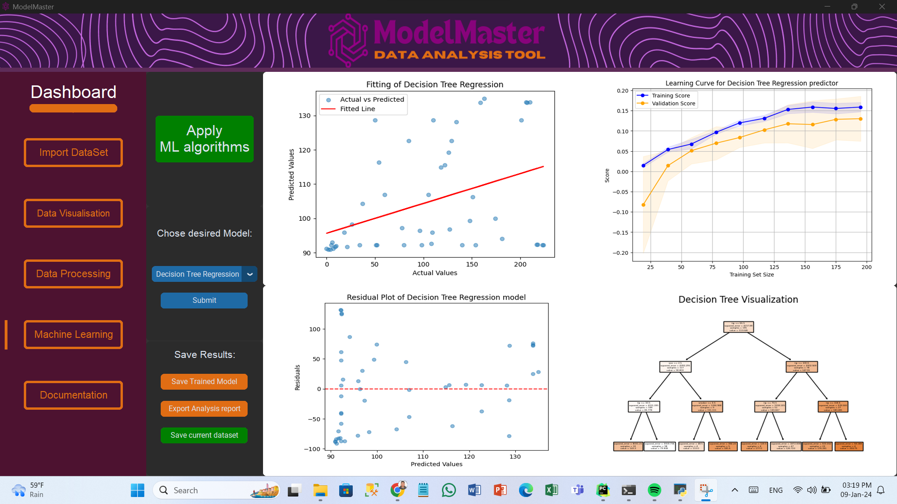
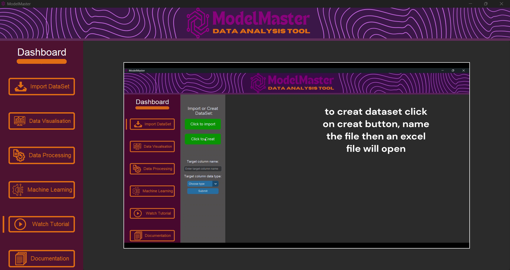
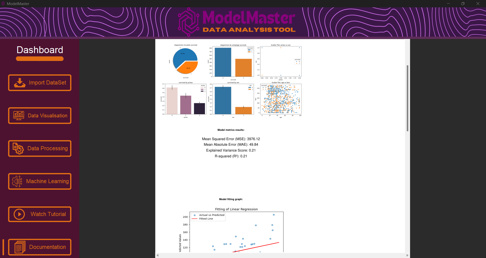

# Data Analysis & Machine Learning Desktop Application

This project is a desktop application developed in Python using CustomTkinter for data analysis and implementation of Machine Learning algorithms. The application provides a user-friendly interface for students and users to analyze both qualitative and quantitative datasets, utilizing various Machine Learning algorithms.
This project was completed as an end-of-module project for the Advanced Programming (Python) course at the University of Abdelmalek Essaâdi Faculty of Sciences and Techniques Tangier.

## Table of Contents

1. [Introduction](#introduction)
2. [Features](#features)
3. [Installation](#installation)
4. [Usage](#usage)
5. [Solutions Provided](#solutions-provided)
6. [Documentation and Tutorials](#documentation-and-tutorials)
7. [Conclusion](#conclusion)
8. [Contributors](#contributors)

## Introduction

This application aims to provide a practical experience in programming and machine learning. It allows the analysis of datasets using multiple Machine Learning algorithms such as Decision Trees, Naive Bayes, Random Forest, and K-Nearest Neighbors.

## Features

- **Intuitive User Interface**: Developed with Tkinter for efficient data manipulation.
- **Data Representation**: Clear and explicit graphical representation of data.
- **Data Management**: Includes data preparation and transformation features like cleaning, handling missing values, and feature scaling.
- **Machine Learning Algorithms**: Implementation of various algorithms allowing users to choose the most suitable model.
- **Model Validation**: Robust evaluation methods to ensure reliable performance.
- **Results Visualization**: Tools like charts and tables for clear interpretation of algorithm performance.
- **Export Results**: Ability to export analysis results, trained models, and visualizations.
- **Comprehensive Documentation**: Includes detailed code documentation and tutorials.

## Installation

1. Clone the repository:
    ```sh
    git clone https://github.com/amine-sabbahi/Python-Data-Analysis-App.git
    ```
2. Navigate to the project directory:
    ```sh
    cd Python-Data-Analysis-App
    ```
3. Install the required dependencies:
    ```sh
    pip install -r requirements.txt
    ```

## Usage

1. Run the application:
    ```sh
    python app.py
    ```
2. Use the intuitive interface to import datasets, visualize data, and apply machine learning algorithms.
3. Follow the on-screen instructions to navigate through the different functionalities of the application.

## Solutions Provided

### Home Interface

The home interface serves as a central dashboard, providing an overview of the application and quick access buttons to different sections like data import, visualization, data processing, machine learning, and documentation.


### Data Import

This feature allows users to import datasets from their computer or create new datasets. It also includes functionalities to define the target column and its type for classification or regression problems.


### Initial Data Visualization

Provides initial exploratory data analysis through illustrative charts, helping users understand their target variable's nature.



### Data Processing

Interactive platform for data preparation, including feature selection, handling missing values, data encoding, and feature scaling.


### Machine Learning Algorithms and Model Validation

Users can apply various machine learning algorithms and validate model performance through detailed metrics like accuracy, precision, recall, and F1 score. The interface also allows model selection and visualization of results.
#### Classification problems


#### Classification Result Visualization


#### Regression problems


#### Regression Result Visualization


### Documentation and Tutorials

Comprehensive documentation and tutorial videos are available to guide users through the application functionalities and machine learning concepts.





## Conclusion

This project successfully delivers a complete and user-friendly application for data analysis and machine learning, providing valuable hands-on experience for students and users in the field of data science.

## Contributors

- **[Khattabi Idriss](https://github.com/drisskhattabi6)**
- **[Sabbahi Mohamed Amine](https://github.com/amine-sabbahi)**
- **[Boufarhi Ayman](https://github.com/aymanboufarhi)**

---

**Abdelmalek Essaadi University** Faculty of Sciences and Techniques Tangier
   - Department : Computer Engineering
   - Master : AI & DS
   - Module : Advanced Programming Language (Python)
   - Framed by : Pr. Sanae KHALI ISSA
