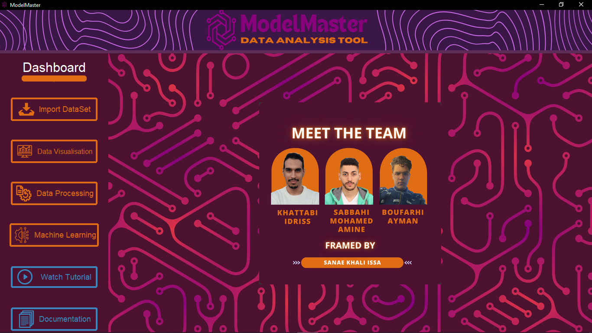
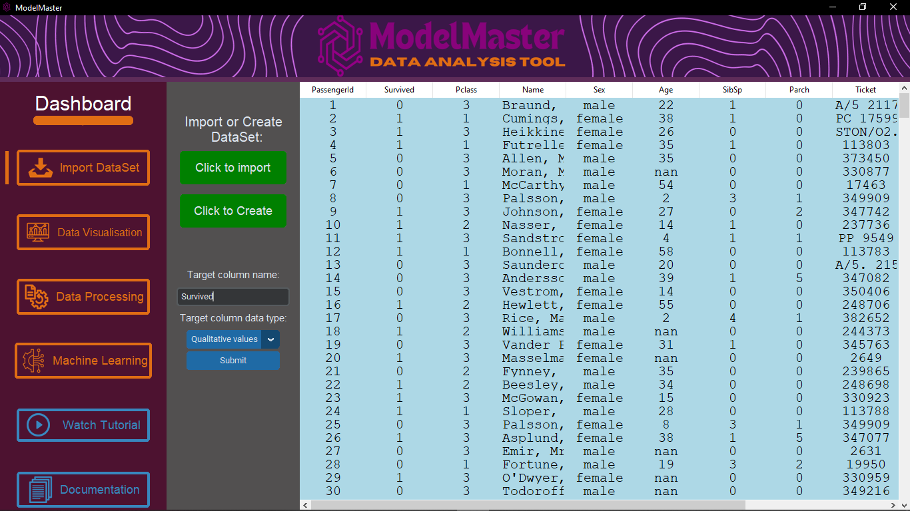
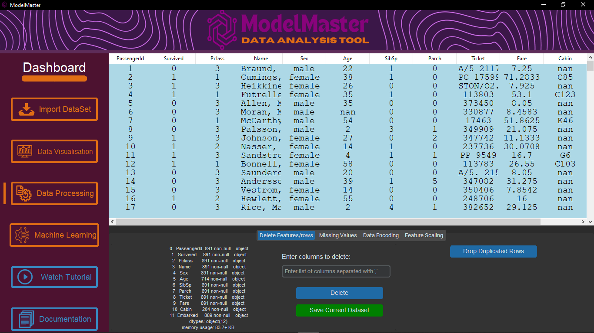
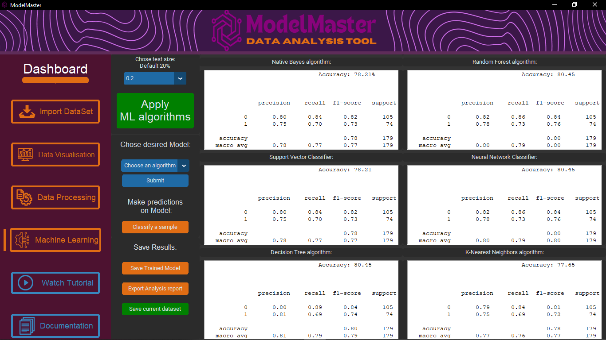
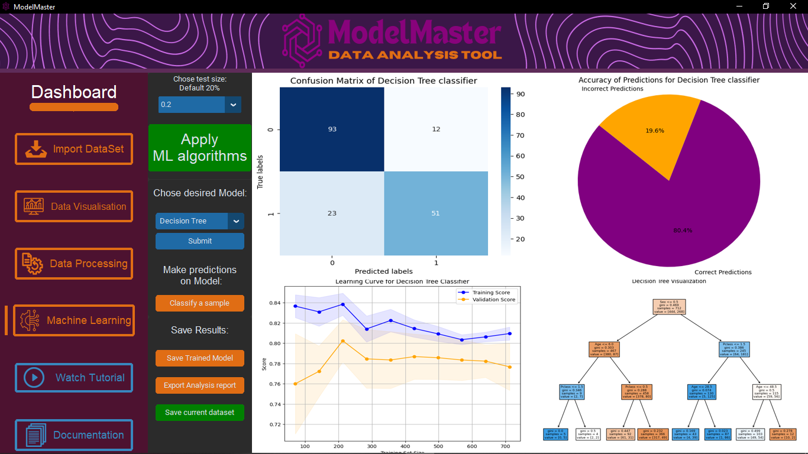

# ML-Toolkits-App

🚀 This Project is for "simplify the Machine Learning process with a desktop app" .

#### 🌟This project carried out in collaboration with "Mohamed Amine Sabbahi" and "Ayman Boufarhi". Under the mentorship of the amazing Prof "Sanae Khali Issa".

The objective was to create a desktop application using the 'CustomTkinter' framework to simplify the Machine Learning process, such as: 
  - ✅importing datasets
  - ✅visualizing data
  - ✅pre-processing data
  - ✅applying different machine learning algorithms
  - ✅validation of the model
  - ✅export of results📊

---------------------

---------------------
🚀 #machinelearning #customtkinter #python #DataManagement #ProjectCollaboration #DataScience #AIInnovation #PythonMagic
